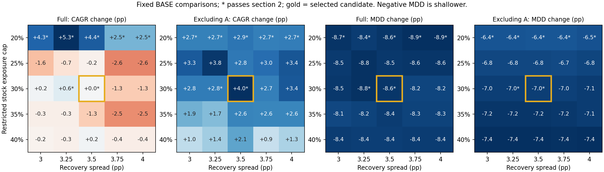
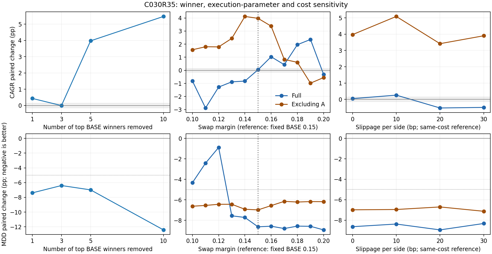

# 30%／3.5个百分点：采纳前评估（2026-09-10）

**投资判断：按用户明确的“牛市顶部降低杠杆、优先降低回撤”目标，倾向有条件采纳。规则判断：尚未通过现行全部采纳要求，不能自动替换生产BASE。** 可取的依据是跨仓位邻域、赢家剔除与成本压力持续存在的最大回撤改善；收益超额、精确参数的最优性不作为采纳依据。本次完成评估，生产仍为E2 BASE；先前“同意方案”不解释为已豁免本轮新发现。

如果“后续基准”要求同时满足现行收益稳定性纪律，当前结论是暂不接受。如果用户继续采用此前明确的回撤优先取舍，我建议对本候选作新的采纳裁定，接受它可能付出一定收益代价、不能普遍降低所有时期回撤的限制。**这是一项风险偏好取舍，不是本轮统计检验已经全部通过。**

证据目录：[exp_c030r35_adoption_20260910](../../data/experiments/exp_c030r35_adoption_20260910/README.md)。以下百分比差均以“百分点”（pp）表示；除明确标注的长跑锚点外，Δ先同起点相减、再对14个起点取中位。滚五P还先在同起点内按同一个月末窗口相减、取中位。

## 1. 具体采用什么规则

股债利差 = 沪深300整体PE_TTM的倒数 − 中国10年期国债收益率。候选C030R35为：

1. 利差 **<3个百分点**，股票市值上限降至净资产的 **30%**，按原执行流程主动减仓并偿债。30%是总股票仓位，不是保留30%的融资。
2. 触发后，利差在3～3.5个百分点之间仍保持受限状态；**达到3.5个百分点**才解除。
3. 已经解除时，落回3～3.5之间不重新触发；只有低于3才触发。恢复只放开原买入与融资许可，不自动补满仓位。

对照E2 BASE在低于3个百分点时限仓100%，达到3即解除。两臂使用相同记账、选股、费用、融资利息、T+1和整手规则。实验包装器重建完整宏观历史状态，不在账户起始日重置开关。

2011长跑实际上只有两轮限制：2015-05-04开始、2015-08-03解除；2018-02-01再次开始，BASE于03-01解除，候选于04-02解除。**2015年利差直接回升到约3.76个百分点，两者解除日相同；3.5门槛在这条路径的额外延迟主要发生在2018年。** 候选受限101/3,602日（2.80%），BASE为79日（2.19%）；平均股票仓位156.01%与160.82%。这仍是大部分时间允许融资的策略。

## 2. 中心方案：最大回撤改善，长跑收益大致守住

| 配对指标 | 全样本Δ | 剔除BASE前五赢家A的Δ |
| --- | ---: | ---: |
| 全期年化CAGR | +0.043 | +3.975 |
| 滚五同窗配对P | −0.853 | +4.443 |
| 全期最大回撤，负号为更浅 | −8.638 | −6.987 |
| 滚五回撤中位，负号为更浅 | −2.120 | +0.769 |
| 滚五最差窗口年化 | +2.026 | +5.210 |
| 非重叠五年块中位 | −2.683 | +4.570 |
| 全期Calmar，比率单位 | +0.140 | +0.195 |
| 全期Sharpe，比率单位 | +0.019 | +0.097 |

中心通过§12.1第2款的回撤通道。BASE最大回撤区间合并后有四段，其中2011～2014与2015～2016两段的跨路径最大回撤差达到至少改善5pp；2018、2020两段未达到。此处遵循现行“按BASE区间归并各路径最大回撤差”的定义，不把28条重复历史路径称为28次独立熊市。

全样本最大回撤更浅13/14起点，年化提高7/14；A表最大回撤更浅13/14、年化提高13/14。候选与BASE的前五赢家并集U恰好等于A，达到“去赢家全面优秀”；唯一轻微劣化项为滚五回撤中位加深0.769pp。**最大回撤改善并不等于所有风险读数都改善。**

| 长跑起点 | BASE年化 | 候选年化 | BASE最大回撤 | 候选最大回撤 |
| --- | ---: | ---: | ---: | ---: |
| 2009-11-01 | 37.84% | 37.34% | 56.37% | 46.29% |
| 2011-11-01 | 37.88% | 38.47% | 52.64% | 47.50% |

全期年化按初始净资产至末日净资产、真实日历年数计算，末日为2026-08-28。14起点各自全期CAGR的水平中位数分别为BASE 46.54%、候选45.02%；这两个独立中位数的差不能代替同起点配对差+0.043pp，因为各臂起点收益的排序不同。完整标准表同时保留水平、配对差与符号数。

同一2015-06-12～2016-02-01区间，2011长跑回撤由52.64%降至38.54%，改善14.10pp，直接支持用户关心的顶部转熊阶段。候选全期最深回撤后来发生在2024-05-29～09-11，仍达47.50%。2015全年收益为32.72%对7.31%，2016年则为−17.74%对+1.72%；2018为−7.88%对−14.09%。保住一次熊市中的资金后，恢复时机及后续持仓分配仍会影响复利。

2011路径的两个完整非重叠块：2016-07～2021-07年化45.68%对48.18%（−2.50pp）；2021-07～2026-07为67.19%对64.69%（+2.50pp）。它们说明后续阶段优势交替，不能仅根据2015少亏推导长期收益必然更高。所有起点与年度明细见`annual_paths.csv`、`nonoverlap_blocks.csv`。

## 3. 仓位、恢复阈值与换仓边际：风险方向宽，完整通过区间窄

预先固定仓位20/25/30/35/40% × 恢复3/3.25/3.5/3.75/4pp，共25格；触发门槛始终为3pp。下表是穿过中心的相邻档。

| 受限仓位／恢复利差 | 全样本年化Δ | A年化Δ | 全样本最大回撤Δ | A最大回撤Δ | 第2款／U优秀 |
| --- | ---: | ---: | ---: | ---: | --- |
| 20%／3.5 | +4.42 | +2.90 | −8.62 | −6.39 | 通过／否 |
| 25%／3.5 | −0.22 | +2.85 | −8.55 | −6.77 | 未过／是 |
| **30%／3.5** | **+0.04** | **+3.97** | **−8.64** | **−6.99** | **回撤通道／是** |
| 35%／3.5 | −1.29 | +2.63 | −8.44 | −7.23 | 未过／否 |
| 40%／3.5 | +0.19 | +2.11 | −8.39 | −7.43 | 未过／否 |
| 30%／3 | +0.17 | +2.77 | −8.55 | −7.01 | 未过／否 |
| 30%／3.25 | +0.63 | +2.77 | −8.78 | −7.01 | 回撤通道／否 |
| 30%／3.75 | −1.33 | +2.71 | −8.16 | −6.96 | 未过／否 |
| 30%／4 | −1.33 | +3.36 | −8.16 | −7.08 | 未过／否 |

25格的最大回撤改善具有明显的一致性，支持“收缩股票敞口能减轻历史尾部”的方向。收益差则不平滑，不能证明30%是独特的最优仓位，也不应看到20%某项更高就改选20%。中心的第2款连续通过区间：仓位只有30%；恢复为3.25～3.5两档。再要求U优秀，恢复轴也只剩3.5。均未形成预登记的至少三个相邻档平台。

候选换仓边际0.10～0.20按0.01重扫。相对固定BASE，0.15、0.17、0.18通过第2款，0.16隔断，包含0.15的平台只有单档；0.14的全/A年化差−0.82/+4.12pp，0.16为+1.04/+3.38pp，但滚五P分别−2.34/−1.21pp而未过。0.13～0.20的全样本最大回撤改善约7.6～8.9pp，仍较一致；0.10～0.12的改善明显减弱。另跑同档BASE以隔离边际变化本身，完整结果在`margin_matched.csv`，不拿它替换预先登记的固定BASE判定。

## 4. 赢家剔除：长期年化没有实质性反号，滚五P有

赢家按本批BASE 2011锚点逐日贡献累计排名。K1=002128；K3再加000651、601088；K5再加000933、000338；K10继续加入600585、688516、601328、600660、002304。每档两臂统一剔除，不在结果出来后更换股票名单。

| 剔除赢家数 | 全期年化Δ | 滚五PΔ | 最大回撤Δ | 回撤更浅起点 |
| --- | ---: | ---: | ---: | ---: |
| 1 | +0.437 | −1.622 | −7.394 | 13/14 |
| 3 | −0.0025 | −2.862 | −6.397 | 11/14 |
| 5 | +3.975 | +4.443 | −6.987 | 13/14 |
| 10 | +5.474 | +6.761 | −12.414 | 14/14 |

K3的−0.0025pp约为−0.25bp，远小于±0.15pp噪声带，不能描述成“剔除赢家后长跑明显跑输”。年化在噪声带外没有方向反转；滚五P的反转则是实质性的，故现行“剂量四档同向”未通过。用户此前关于“滚五配对中位负值不必然对应全期复利下降”的质疑，在这里再次得到具体例证。

我的解读是：剔除赢家并未破坏降回撤作用，也未发现全期CAGR稳定大幅变差；**它仍不能证明滚五典型持有体验全面改善**。应保留P作为分段路径的描述与风险偏好信息，不能把它替代全期年化，也不能在本轮结果出来后声称现行P要求已经通过。

## 5. 交易成本：回撤改善保留，可能付出收益代价

每边滑点进入真实成交价、股数、现金、整手、费税与强制减仓，两臂同档比较；A/U按0bp赢家固定。表中每格为全样本／A。

| 每边滑点 | 全期年化Δ | 滚五PΔ | 最大回撤Δ | 第2款判定 |
| --- | ---: | ---: | ---: | --- |
| 0bp | +0.04／+3.97 | −0.85／+4.44 | −8.64／−6.99 | 回撤通道 |
| 10bp | +0.26／+5.09 | −3.12／+7.90 | −8.38／−6.96 | 未过 |
| 20bp | −0.53／+3.42 | −2.59／+4.50 | −8.95／−6.71 | 未过 |
| 30bp | −0.50／+3.90 | −2.33／+5.54 | −8.33／−7.13 | 未过 |

滑点不是标准规定的独立否决线；“非零滑点档未过”主要来自滚五P，20/30bp还伴随全样本年化低于−0.15pp。回撤优势没有消失。20/30bp观察到约0.5pp的年化代价，是支持有条件取舍的历史读数，**不是未来年化损失上限或预测**。

全/A所有成本档两臂强平次数均为0，负现金日均为0。全样本最低担保比例约1.82，两臂相同；A表BASE各档约1.70～1.72，候选约1.86～1.87。全样本滚五回撤中位改善约1.55～3.18pp，A则加深0.77～1.43pp。BASE各成本档相对0bp的全部变化，以及逐路径尾部，见`slippage.csv`与标准附表。

## 6. 信号层、归因与证据边界

两臂各跑250/750日前向选择三表、换仓四表的±0.04/0.10/0.15三档匹配对照。每张原表与逐日数据保存在`sig/`，汇总同时列有效日期数、为正日数与逐年同号数。

| 前向／信号表 | BASE水平 | 候选水平 | 共同日期配对差中位 | 年度为正：BASE／候选 |
| --- | ---: | ---: | ---: | --- |
| 250日，边际选择 | +3.36% | +7.07% | 0，76日 | 8/12／10/12 |
| 750日，边际选择 | +25.61% | +23.73% | 0，56日 | 7/10／7/10 |
| 250日，换仓方向 | −2.45% | −2.59% | 0，149日 | 6/14／6/13 |
| 750日，换仓方向 | −10.88% | +9.72% | 0，109日 | 6/12／7/11 |

整体水平来自各自实际交易日期，不能直接相减声称同日选择进步。排名表在两臂逐日相同；补充的rank1对rank2～5、rank6～10日内配对表也相同。表3的总不同“源、目标”配对数为BASE 155、候选145，前向窗口还重叠，不能把几百个交易日当成独立样本。

面板P/V信息量与合成换仓输入及输出均相同。匹配检验中，候选2015年的实际差与合成换仓反号，且三档容差下超额均为正，支持该历史阶段改变交易路径的作用；2016/2020的实际差对容差变号，不作为稳健机制结论。2012的实际差为负而合成为正，两臂均出现。更晚年份仍有较多负匹配超额，不能推广成普遍增强选股。共享P/V分档使用2026人工质量标签，含后视，只作上界诊断。

按contrib归因，净Δ=−0.0203；按绝对贡献差排序的前三只为000651、601088、000338，净额占比52.65%、总绝对变动占比53.72%，未超过第11款的100%界线。但净分母很小，前五净额占比125.3%；这不是广泛收益增强的证明，contrib之和也不是CAGR之差。

估值预测与可实施择时的收益并非同一问题，公开研究也报告两者之间的落差；此处仅作方法背景，不用海外研究背书本仓库的具体阈值。[Asness、Ilmanen与Maloney，2017](https://www.aqr.com/-/media/AQR/Documents/Insights/White-Papers/Market-Timing-Sin-a-Little.pdf)

本批52个登记臂名，48个新参数组合、4个旧组合复核；新组合中35个候选、13个换仓／成本对照。同族先前72个登记臂名，本轮登记后124个。1,624条正式路径、2条带流水锚点路径；U=A与K5=A复用后汇总2,324行。**这是看到上一轮结果后对同一历史样本的进一步研究，不是独立样本外验证。** 2011以来宏观限制仅两轮，精确阈值的独立验证事件很少。

296只股票历史末端为155只2026-08-07、140只2026-08-28、1只2018-12-20，沿用原策略缺行情处理；净值末日08-28，完整滚动窗口截止07月。输入哈希与前批一致，56条BASE/候选全/A路径逐字段复现。完整14起点、逐日日期、独立推导的全部滚五月末窗口、有限决策值均通过核验，负现金0。OI-172/173采用实验内完整性与“负窗0转正”校验；生产缺陷未借本批暗改，OI-167整手行为也与BASE保持同口径。宏观序列是当前下载版本，未验证历史修订前的全部数据版本。

作业26528686完成，64核、48回测worker及最多4信号worker，11分24秒，峰值约65.8GiB。15项针对性检查通过；原始输入、算法、预登记、统计表和图均可复现。

## 7. 采纳裁定需要明确的取舍

| 项目 | 本轮状态 | 对判断的含义 |
| --- | --- | --- |
| 中心第2款、U资格 | 通过 | 已有可考察资格 |
| 仓位／恢复与换仓连续平台 | 未形成预登记平台 | 精确参数的收益优势不稳；回撤方向较宽 |
| K1/3/5/10收益同向 | P未过；CAGR在噪声外同向 | 不能称长跑大幅反号，也不能称所有收益检验通过 |
| 滑点压力 | 数值判定翻转，最大回撤优势保留 | 需接受潜在收益代价；档位不单独否决 |
| 信号层、归因、登记、完整性 | 齐备 | 没有得到普遍选股增强或未来收益的证明 |

**建议的采纳理由只取最大回撤改善，以及该方向在邻域、K剂量和成本档的保留。** 需要的新裁定是：是否接受本轮未形成完整收益平台、滚五P剂量不同向和成本下年化可能下降的取舍，并据此采用该风险约束。此前对E2的回撤优先裁定可作偏好参考，不能自动充当本候选的规则豁免。

截至本报告，仅形成“有条件采纳”的分析建议，未改工作流规则、生产常量、实盘融资许可或回测BASE，也未改选其他参数峰值。复利收益全/A标准表、信号差表、条件状态与图表均已登记，供本轮裁定使用。
