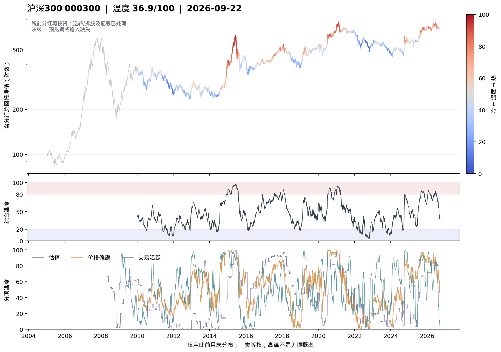
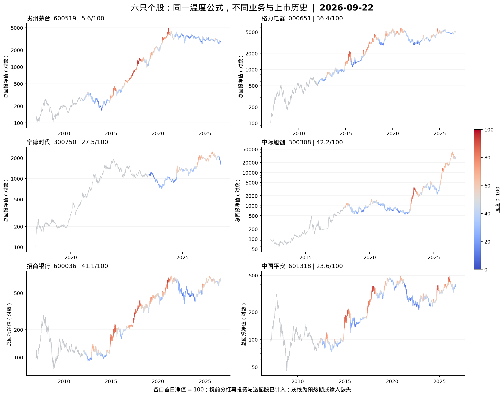
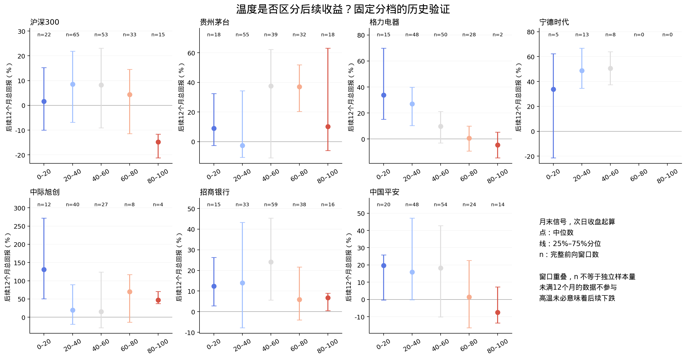

# CBBI 思路在沪深 300 与六只个股上的温度验证

截至北京时间 2026-09-22 收盘。研究轨道 B，前向收益诊断，未采纳为生产交易规则。

第一版结果支持把沪深 300 温度作为**长期过热观察指标**继续研究，但不足以认定它是可靠的买卖计时器。个股的表现差异明显：茅台不支持简单的“越冷越值得买”，中际旭创高温后仍可能大涨，宁德时代历史不足。格力的相关性较强，却有严重的高温样本稀少及停牌终点缺失问题。不能从这七个指定标的推断全市场有效性。

这是借鉴 CBBI“多项标准化后合成”的三类原型，没有搬用比特币链上指标，也没有复刻其事后拟合的峰谷边界。原站研究见[前一份源码报告](cbbi_a_share_transfer_2026-09-22.zh.md)；本轮的[原始预登记及数据修订](../../data/experiments/exp_cbbi_temperature_20260922/protocol.md)、[配置](../../data/experiments/exp_cbbi_temperature_20260922/config.json)均保留。

## 1. 沪深 300 温度图



曲线是中证官方 H00300 全收益序列归一化后的净值，包含税前现金分红再投资；不是普通价格指数点位。采用对数轴，颜色表示当日温度，灰色表示预热期或输入缺失。指标须先积累长期均线与历史参考分布，因此从 2010-01-04 才有完整温度，**图上的 2007—2008 年灰线不属于已验证温度样本**。官方收益口径参照[中证沪深300指数编制方案](https://oss-ch.csindex.com.cn/static/html/csindex/public/uploads/indices/detail/files/zh_CN/000300_Index_Methodology_cn.pdf)。

当前沪深 300 为 **36.9 / 100**。三项分别为估值 **50.0**、价格偏离 **57.5**、活跃度 **3.3**：当前偏低读数主要受相对成交量收缩影响，不能解释成估值极低，更不是“上涨概率 63.1%”。

## 2. 温度怎么算

令 $Q_t(x)$ 为原量 $x_t$ 在**当前月份之前、最近最多 60 个有效月末观测**中的中秩百分位。至少需要 36 个有效月末；缺失月不拿月中数据冒充，缺失较多时参考历史可能超过五个自然年。原量较高得到较热分数，不使用未来高低点重设边界。

| 类别 | 原量与处理 | 解释 |
| --- | --- | --- |
| 估值 $V_t$ | $Q_t(y_{10Y}-E/P)$ | 盈利收益率相对国债越低，估值分数越热 |
| 价格偏离 $P_t$ | $\frac12[Q_t(\log(TR/MA_{250}(TR)))+Q_t(\log(TR/MA_{500}(TR)))]$ | 含权总回报偏离长期均线越远，越热 |
| 交易活跃 $A_t$ | $Q_t(\log(MA_{20}(Vol^*)/MA_{250}(Vol^*)))$ | 相对长期基准越放量，越热 |

$$
T_t=(V_t+P_t+A_t)/3.
$$

三类缺任何一类，主温度就留空。$Vol^*$ 将送转和配股前后的成交量统一到相同股份单位，未因现金分红调整成交量。该量是**相对量能代理**，不是实际筹码成本、真实换手率或融资拥挤度；指数成交量还受成分调整影响。本轮未加入融资这一维，因而没有验证此前提出的完整四类方案。

指数估值取仓库中已有的沪深 300 整体 TTM PE 和国债收益率快照，来源是[乐咕乐股历史估值](https://legulegu.com/stockdata/hs300-ttm-lyr)及已有国债日序列；PE 历史主要为月度，按观测日严格滞后一天、最多沿用 45 天。因此不能声称指数估值项用了每日完整更新的财务数据。

个股使用已公布归母净利润 TTM ÷（当日未复权价格 × 当日历史有效总股本），减去此前可得国债利率。非年末 TTM 用“上一年度 + 当年累计 − 上年同期累计”，三份报告公告日都须早于信号日；未公布、缺组成期、盈利非正时不产生该项温度。不能将当前 EPS 或最新复权价套回过去。A+H 公司以总归母利润和全部普通股股数计算 A 股价格下的每股盈利收益率，属于对应 A 股的盈利估值代理，不是 A、H 分别计价的实际总市值。

## 3. 沪深 300 的前向验证

固定低温 ≤20、高温 ≥80，月末生成信号，从下一市场交易日收盘测量未来 12 个自然月的累计全收益；3/6 个月为辅助。未满期不补值。这里没有模拟仓位、换仓、费税与成交滑点，故不是可投资组合收益。

| 温度档 | 完整月末样本 | 后一年收益中位数 | 后一年亏损比例 | 后一年路径最大回撤中位数 |
| --- | --- | --- | --- | --- |
| 0–20 | 22 | +1.6% | 40.9% | -19.3% |
| 20–40 | 65 | +8.6% | 36.9% | -17.2% |
| 40–60 | 53 | +8.2% | 35.8% | -16.1% |
| 60–80 | 33 | +4.4% | 45.5% | -21.2% |
| 80–100 | 15 | -14.8% | 86.7% | -29.1% |

低温与高温的后一年中位数差为 **+16.5 个百分点**，12 个月连续月历区块重抽样的条件 95% 区间约为 **[+2.1, +34.8] 个百分点**。但全部月末温度与后一年收益的 Spearman 秩相关仅 **−0.166**，区间 **[−0.478, +0.080]**，包括零；收益分档也不是严格单调。20—60 档的后一年中位数约 8%，反而高于最低温档的 1.6%。这更像过热观察线索，不能把最低温直接叫“最佳买点”。

为显示重复采样的影响，同一主体再按 MA60 周期及同档一年窗口不重叠计算：

| 采样方式 | 低温完整窗 / 收益中位数 | 高温完整窗 / 收益中位数 |
| --- | --- | --- |
| 逐日 | +1.5%（n=405） | -13.5%（n=328） |
| 月末 | +1.6%（n=22） | -14.8%（n=15） |
| MA60 周期首次 | +2.4%（n=383） | -15.0%（n=61） |
| 周期后同档一年窗口不重叠 | +9.2%（n=8） | +1.2%（n=4） |

冷/热不重叠完整窗口仅 **8 / 4** 个，中位数变成 **+9.2% / +1.2%**，高温后的中位数转正。冷热差方向仍为正，但样本很少，不能用 405 或 328 个逐日窗口装作独立证据。完整高温月末中 7 个来自 2015 年，3 个来自 2020 年、3 个来自 2021 年，另各 1 个来自 2017/2018 年，集中于少数行情阶段。

辅助期限也不支持短线顶底判断：高温后 3 个月中位数 **+1.3%**，6 个月 **−5.2%**，12 个月 **−14.8%**。低温后 3/6 个月分别约 **+1.8% / +2.5%**。不同期限的完整样本数不同，不能把三个中位数拼成一条实际持有路径。

## 4. 六只个股温度图与当前分项



各票从研究起点净值 100 开始，横纵轴跨度不同，不能据图高低横比投资回报。每只票均另有含温度曲线和分项的完整图。

| 标的 | 温度 | 估值 | 价格偏离 | 交易活跃 | 温度有效起点 |
| --- | --- | --- | --- | --- | --- |
| 沪深300 | 36.9 | 50.0 | 57.5 | 3.3 | 2010-01-04 |
| 贵州茅台 | 5.6 | 1.7 | 15.0 | 0.0 | 2012-02-01 |
| 格力电器 | 36.4 | 28.3 | 47.5 | 33.3 | 2012-02-01 |
| 宁德时代 | 27.5 | 0.0 | 25.8 | 56.7 | 2023-07-03 |
| 中际旭创 | 42.2 | 43.3 | 58.3 | 25.0 | 2018-02-01 |
| 招商银行 | 41.1 | 48.3 | 63.3 | 11.7 | 2012-02-01 |
| 中国平安 | 23.6 | 0.0 | 47.5 | 23.3 | 2012-05-02 |

“估值温度为 0”表示低于参考历史分布，不是盈利为零，也不表示没有风险；负盈利或输入缺失会留空。茅台当前三项都低，因此读数为 5.6，但这只是相对历史状态，下面的收益验证并不支持据此保证反弹。

## 5. 同一公式在个股上的结果



图中点为中位数，竖线为 25%—75% 分位，**不是置信区间**；n 是完整月末窗口数，窗口仍会重叠。下表列出主窗口以及考虑连续月历依赖的相关性区间。

| 标的 | 有效月末数 | 低温后一年 | 高温后一年 | 秩相关 ρ | ρ 的区块区间 |
| --- | --- | --- | --- | --- | --- |
| 沪深300 | 188 | +1.6%（n=22） | -14.8%（n=15） | -0.166 | [-0.478, +0.080] |
| 贵州茅台 | 162 | +9.0%（n=18） | +10.2%（n=18） | +0.250 | [-0.151, +0.486] |
| 格力电器 | 143 | +33.8%（n=15） | -4.7%（n=2） | -0.461 | [-0.718, -0.173] |
| 宁德时代 | 26 | +33.7%（n=5） | —（n=0） | +0.094 | [-0.347, +0.243] |
| 中际旭创 | 91 | +130.6%（n=12） | +47.0%（n=4） | -0.078 | [-0.387, +0.211] |
| 招商银行 | 161 | +12.3%（n=15） | +6.8%（n=16） | -0.160 | [-0.492, +0.136] |
| 中国平安 | 160 | +19.6%（n=20） | -7.5%（n=14） | -0.206 | [-0.454, +0.060] |

逐只解释：

- **贵州茅台**：主温度与未来收益的相关方向为正；低温后一年约 +9.0%，高温约 +10.2%，没有“越冷、以后赚得越多”的简单关系。48/72 个月参考窗均保留正相关。这提示长期增长、估值中枢变化等因素可能使均值回归解释失效；这是解释假设，不是本实验识别出的因果机制。
- **格力电器**：主相关 −0.461，48/72 个月下也为负，是较值得继续研究的对象。但是高温月末共 5 个，只有 **2 个**能获得严格一年终点报价，其余 **3 个终点落在停牌缺报价区间**。仅存高温样本来自 2017/2018 年；缺失不是随机抽样，不能将 +33.8% 对 −4.7% 宣布为可靠收益优势。表内冷热差区块抽样也仅 834/1000 次同时保留冷热样本。
- **宁德时代**：2018 年上市，直到 2023-07-03 才完成本公式预热；仅 **26 个**完整一年期月末样本，且 **没有 ≥80 的高温样本**。不足以验证顶部识别，不能缩短窗口去追求一张更完整的漂亮历史图。
- **中际旭创**：主相关 −0.078，高温后一年仍有约 +47.0% 的中位数，不能见红就视为卖点。[2017 年年度报告](https://static.cninfo.com.cn/finalpage/2018-04-12/1204615997.PDF)记录了当年重大收购与发行；从 2018 年重新预热后，与主指标共同有效的完整月末仅 32 个，重置指标低温仅 1 个、高温 5 个。如此小的样本不支持重新校准冷热阈值。
- **招商银行**：月末冷热差约 +5.6 个百分点，相关性区间跨零；不重叠口径下冷热顺序还会反转。TTM 盈利温度也未覆盖信用质量、拨备、资本约束与股息可持续性。
- **中国平安**：月末冷热差约 +27.1 个百分点，但相关性与冷热差的区块区间均跨零；不重叠口径下高温后也为正收益。保险的投资损益及会计变化使统一 TTM 估值解释需要额外审查。

同档不重叠一年窗口的结果如下，全部仍是单票累计收益诊断：

| 标的 | 不重叠低温窗口 | 不重叠高温窗口 |
| --- | --- | --- |
| 沪深300 | +9.2%（n=8） | +1.2%（n=4） |
| 贵州茅台 | -0.5%（n=5） | +19.1%（n=5） |
| 格力电器 | +54.6%（n=6） | -9.3%（n=4） |
| 宁德时代 | +20.2%（n=2） | —（n=0） |
| 中际旭创 | +79.7%（n=5） | +126.5%（n=2） |
| 招商银行 | +5.9%（n=4） | +23.5%（n=5） |
| 中国平安 | +24.3%（n=6） | +17.6%（n=3） |

各温度档分别去重，因此各档之间仍可能重叠，同一市场中各票也会相关。不得将此表的 n 相加称作联合独立样本量。MA60 周期定义为首次符合该温度档，到收盘跌破当日复权 MA60 后允许新周期；离开温度档后回来不自行重启；周期结束不提前截断固定一年收益。若首次信号当天已低于 MA60，周期会当日结束，因此它本身未必大幅减少低温逐日重复，必须同时看不重叠列。

## 6. 对照与参数敏感性

下表为各对照与主温度**同日交集**上的一年期月末秩相关，越负仅表示越支持“温度高、后续收益低”这一诊断方向，不是组合绩效排名。

| 标的 | 三类主温度 | 仅估值 | 价格+活跃 | 48 个月参考 | 72 个月参考 |
| --- | --- | --- | --- | --- | --- |
| 沪深300 | -0.166 | -0.235 | -0.105 | -0.146 | -0.179 |
| 贵州茅台 | +0.250 | +0.360 | +0.051 | +0.240 | +0.266 |
| 格力电器 | -0.461 | -0.401 | -0.241 | -0.421 | -0.462 |
| 宁德时代 | +0.094 | -0.119 | +0.142 | +0.100 | +0.102 |
| 中际旭创 | -0.078 | -0.278 | +0.040 | -0.070 | -0.078 |
| 招商银行 | -0.160 | -0.077 | -0.136 | -0.204 | -0.181 |
| 中国平安 | -0.206 | -0.276 | -0.143 | -0.183 | -0.190 |

沪深 300 仅估值的相关性 **−0.235**，绝对值比三类合成的 **−0.166** 更高；中国平安及中际旭创也有类似现象。**本轮没有证明多因子合成一定优于简单估值。** 没有据此事后改权重，48/60/72 个月结果一起保留；也没有做足以支持采用新策略的生产 BASE 配对组合 A/B。

## 7. 分红、拆股、配股和早期股改如何处理

个股用未复权价格与实际权益构造总回报。普通单个事件在除权日前后：

$$
1+r_t=\frac{(1+b_t+q_t)P_t+d_t-q_tK_t}{P_{t-1}},\qquad
TR_t=TR_{t-1}(1+r_t).
$$

此处 $P$ 为未复权股价，$d$ 为每旧股实际税前现金分红，$b$ 为送转/拆股新增比例，$q$ 为配股比例，$K$ 为认购价。配股认购款被扣除，不把付费获得股份当成免费收益；这是净掉认购资金后的理论再投资口径，未模拟个人账户的现金调拨。停牌间多事件按时序累计股数和现金，在下一可得收盘报价再投，不虚构停牌期间成交。同日不同分配方案先去重再合计，不丢同日另一笔分红。

现金股息按除权事件确认权益并按理论总回报再投资，未逐笔等待现金实际到账；采用税前口径，未扣个人持股期限相关股息税、交易费税及整手约束，因此不能称为税后账户实盘回报。

总回报用**投资者实际权益**，MA60 周期用仓库规定的**交易所除权参考参数**，两者有差异时不能混用。公司回购账户不参与分配等情形，会使这两套参数不同；原有公告修正随输入冻结。

具体核对：

| 事件 | 未复权观察 | 本轮处理 |
| --- | --- | --- |
| 宁德时代 2023-04-26 | 385.90 → 224.50，表面 −41.82% | 每旧股获 0.8 新股和 2.52 元现金，含权当日收益 **+5.37%** |
| 宁德时代 2024-04-30 | 209.63 → 202.60，表面 −3.35% | 采用公告核验的每股实际分红 **5.028 元**，含特别分红，含权收益约 **−0.96%**；不是供应商漏项值 2.011 元 |
| 招商银行 2010/2013 配股 | 除权后价格改变 | 分别按每旧股配 0.13 股、价 8.85 元；配 0.174 股、价 9.29 元，计入股份并扣除认购款 |

宁德时代特别分红来源为[2023 年度权益分派实施公告](https://pdf.dfcfw.com/pdf/H2_AN202404231631059060_1.pdf)，仓库已保存原公告核验哈希；本轮冻结该修正。所有 135 个研究区间公司行动的显式现金/股份台账与总回报逐项一致。这能验证计算一致性，不等于证明供应商每个事件都绝无遗漏。

初轮审计另发现普通分红源没有完整包含早期股改权益：格力 2006 年每 10 股获 2.7 股对价；茅台、招行还涉及权证，不能把权证当成零价值。依据分别为[格力发行文件](https://static.cninfo.com.cn/finalpage/2012-01-11/60429885.PDF)、[茅台 2006 年年报](https://static.sse.com.cn/sseportal/cs/zhs/scfw/gg/ssgs/2007-04-03/600519_2006_n.pdf)、[招行股改实施公告](https://static.cninfo.com.cn/finalpage/2006-02-22/16476009.PDF)。

因此六票统一只采用 **2007 年起或更晚上市日**的股票历史，并从此重新预热，不展示无法完整还原的股改前“总回报”。相当于该日起新买入股票，不包含此前股东持有的权证。初轮作业与结果留在 `superseded_initial_run/`，已作废；这一修订是在初轮诊断后发现数据缺陷而做，不能包装成完全盲测。研究温度均未覆盖 2007—2008 年，早期样本剔除也是本轮证据边界。

## 8. 数据与复现边界

行情刷新至 2026-09-22，来源为腾讯未复权历史接口；六票现金送转来自东财，配股来自新浪并与仓库已有数据合并；财报及历史股本为冻结的既有/刷新数据。17 个输入文件均有 SHA-256。沪深 300 普通价格与官方序列有 5,276 个共同日期，最大差 0.01 点；用于收益的官方 H00300 在所用 5,277 个市场日期全部有值。官方源独有日期另存日历审计，未拿它们当作交易日。

新行情与旧缓存有 23 条收盘差异，最大约 1.64%，本轮统一采用新冻结报价并保存差异清单。计算对截止日前追加数据具有因果不变性：删除 2025-08-27 之后的报价、公司行动、报告和股本数据重新计算，此前温度、个股总回报、量能与估值均不变。但这只能排除本实现显式引用未来行；回溯财报可能存在后来的修订版本，历史股本也缺逐条公告时间，**不能声称已构建完全可靠的历史版本数据库**。

停牌时测量起点或严格日历终点无报价就保留缺失，不用下一个复牌日冒充原终点。中途停牌的路径回撤仅反映可观测报价，不代表停牌资产随时可变现。未满一年单列。特别是格力的缺失集中在特定行情，可能改变结论；不能只报留下来的成功样本。

重抽样为 1,000 次、12 个月连续月历块，保留缺失月份。区间是给定这段历史与这些选择的条件估计，未消除六只股票事后指定、共同市场周期、重复模型比较、参考窗选择和制度变迁的偏差。未另留一段完全未看过的外部验证期。

复现入口（冻结输入已在实验目录；不需要重新取生产数据）：

```bash
python3 scripts/test_cbbi_temperature.py
python3 scripts/test_suspended_actions.py
sbatch --account=tes21035 --export=ALL,STAGE=run scripts/slurm/cbbi_temperature_20260922.sbatch
```

只调整图形排版时可运行 `python3 scripts/experimental/cbbi_temperature.py --plots-only`。主计算单进程，最终 SLURM 作业 **27021684** 完成，2 分 44 秒、峰值约 268 MiB；取数作业 **27021230** 完成。14 项专项测试和 9 项既有停牌公司行动测试通过；17 个输入哈希、135 个行动台账、1,157 个不同期限的同档不重叠完整窗口及汇总回算通过。资源、代码哈希与检查明细见实验文件。

文件索引：

- [全部分档汇总 CSV](../../data/experiments/exp_cbbi_temperature_20260922/bin_summary.csv)、[逐公司/年份/采样方式 CSV](../../data/experiments/exp_cbbi_temperature_20260922/year_sample_distribution.csv)、[同日交集对照 CSV](../../data/experiments/exp_cbbi_temperature_20260922/matched_comparisons.csv)。
- [当前温度及覆盖 CSV](../../data/experiments/exp_cbbi_temperature_20260922/coverage.csv)、[公司行动核对 CSV](../../data/experiments/exp_cbbi_temperature_20260922/corporate_action_audit.csv)、[验证记录 JSON](../../data/experiments/exp_cbbi_temperature_20260922/verification.json)、[输入与来源清单](../../data/experiments/exp_cbbi_temperature_20260922/input_manifest.json)。
- [贵州茅台完整图](../../data/experiments/exp_cbbi_temperature_20260922/figures/temperature_600519.png)、[格力电器完整图](../../data/experiments/exp_cbbi_temperature_20260922/figures/temperature_000651.png)、[宁德时代完整图](../../data/experiments/exp_cbbi_temperature_20260922/figures/temperature_300750.png)、[中际旭创完整图](../../data/experiments/exp_cbbi_temperature_20260922/figures/temperature_300308.png)、[招商银行完整图](../../data/experiments/exp_cbbi_temperature_20260922/figures/temperature_600036.png)、[中国平安完整图](../../data/experiments/exp_cbbi_temperature_20260922/figures/temperature_601318.png)。
- 全部图另有同名 SVG，可编辑文字。`daily_代码.csv` 为逐日源数据，`forward_signals.csv` 为逐条前向窗口；它们保留在工作区，可由冻结输入重建，未将大件派生行加入 Git。

本轮保留原公式与全部反例。若进一步推进，应先研究沪深 300 相对“仅估值”的增量价值，并增加独立市场区间；个股应另按业务类型检验盈利可比性。当前结果没有提供将统一温度直接转成七个标的买卖指令的依据。
