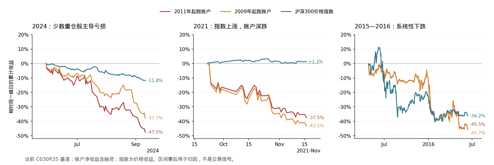

# 当前基准的大回撤与下一步风控方向（2026-09-11）

**最值得先检验的是“持仓集中度的压力损失＋组合波动风险预算”。现有股债利差规则处理了部分高估值阶段，但剩余大回撤更多暴露出少数周期股集中、融资放大以及风险指标滞后的问题。** 本轮查清历史路径并检查指标何时可见，尚未进行新风控规则的收益回测，不支持直接改生产参数。

基准为已采纳的C030R35、计量m3，14起点全样本与去前五赢家A共28条路径，净值截至2026-08-28。2009-11和2011-11两条全样本长跑加只读记录重放，共7,692行净值逐字段完全一致。证据、复现方式与观察条件见[实验目录](../../data/experiments/exp_drawdown_review_20260911/README.md)。

## 回撤最大的几段

下表按**2011-11长跑**的独立回撤段排序。峰值以后直到恢复旧高点才算一整段，不把同一段内的多个小反弹重复计数。“沪深300同期”是策略峰谷同日的指数价格收益，不是指数自己的最大回撤。个股拖累是期内实际持仓盈亏除以峰值净资产，包含期间加减仓与分红；不是拿峰日持仓简单乘区间股价跌幅。

| 峰日→谷日 | 账户回撤 | 沪深300同期 | 恢复旧高点 | 最大的个股拖累，百分点 |
| --- | ---: | ---: | --- | --- |
| 2024-05-29→09-11 | **47.50%** | −11.83% | 2024-11-07 | 神火股份−27.64、电投能源−20.50 |
| 2013-02-08→06-25 | **47.16%** | −21.87% | 2014-12-02 | 潍柴动力−18.37、海螺水泥−13.85、格力电器−12.95 |
| 2015-04-27→2016-06-13 | **45.54%** | −36.22% | 2017-05-25 | 中国神华−15.45、盐湖股份−12.01 |
| 2021-09-22→11-16 | **37.46%** | **+1.28%** | 2022-02-11 | 电投能源−14.16、海螺水泥−11.16、中国神华−10.20 |
| 2020-01-03→03-23 | **34.16%** | −14.83% | 2020-07-06 | 天齐锂业−10.44、潍柴动力−9.33、电投能源−6.75 |
| 2020-07-20→2021-02-05 | **34.15%** | **+17.16%** | 2021-08-31 | 电投能源−20.11、海螺水泥−7.25、天齐锂业−6.57 |
| 2018-06-12→2019-01-03 | **33.86%** | −22.51% | 2019-02-25 | 海螺水泥−13.24、潍柴动力−11.96、格力电器−4.04 |

2024两只主要亏损股的拖累合计48.14个百分点，大于净回撤47.50%，是其他股票净盈利抵消了一部分亏损；未分摊费用税息等另拖累约0.62个百分点。完整逐股加总与残差见[归因表](../../data/experiments/exp_drawdown_review_20260911/attribution.csv)。不能把两只各自的损失占比误解为彼此独立。

另一条2009-11长跑也出现同类问题：2011-07→2013-06回撤46.29%，2015-04→2016-06为45.69%，2021-09→11为43.12%，2020-01→03为42.89%，2024-05→09为37.71%。此外，**2026-03-12→06-30回撤35.02%，截至08-28尚未恢复旧高点**；沪深300同期上涨6.23%，中材国际与神火股份分别拖累11.76和11.38个百分点。这段仍是持仓风险与指数走势分离的例子。

跨起点核对：全样本最深为**51.04%**（2010-11起跑，2011-07-13→2013-06-25），并非在册“最大回撤中位46.03%”就是所有路径的风险上限。去赢家A最深50.25%，13/14条A路径的全期最大回撤落在2018-07-30→2019-01-03，说明需要保留2018慢熊的验证，不能只围绕2024两个赢家设计规则。详见[28条路径最大回撤](../../data/experiments/exp_drawdown_review_20260911/path_max_drawdowns.csv)。这些起点共享大量历史，不是28个独立样本。

本轮2015段从04-27的真实账户高点开始，包含2016年的后续下跌；此前采纳报告的38.54%是指定2015-06-12→2016-02-01区间的读数，两者区间不同，不是基准发生变化。

## 主要风险在哪里

**第一，少数持仓足以决定整个账户。** 2024峰日，神火61.2%、电投57.8%、交通银行25.5%，前三合计144.5%净资产，占股票市值86.7%。前两只合计119.0%净资产；静态假设它们同时跌20%、其他持仓不动，账户约损失23.8%。前三同时跌20%，约损失28.9%。这是压力情景的算术，不是未来跌幅预测。

2021峰日，中国神华50.2%、海螺49.0%、电投44.9%，前三合计144.1%净资产；这些名字虽然不同，煤炭、电力、材料与周期需求等共同暴露仍须单独研究。2018峰日潍柴64.6%与海螺62.4%，两只几乎占满当时股票持仓。单纯统计股票只数、或者检查买入时是否超过60%，不足以刻画已持有组合的压力损失。

**第二，融资会放大这种集中。** 上表前六段峰日总股票仓位均约166.6%净资产。静态假设所有股票同跌20%，净资产约跌33.3%，未含费用税息；下跌后债务不会同步缩小，仓位比例还会被动升高。2021段两条长跑谷日总股票仓位分别达到约187%和196%。授信约束与强平线解决的是融资可用性和券商清算，不等价于较低的策略回撤。

**第三，当前股债规则对这些阶段大多不触发。** 2011长跑的七大段中，只有2015—2016段含受限日（64日）；其他六段均为0。2024段利差6.30～7.04个百分点，2021段4.92～5.21，2013段5.40～6.83，均处于现行触发线之上。估值便宜与短期继续下跌可以同时发生，因此继续只调股债阈值未必覆盖剩余风险。

## 已检查的指标：有信息，但单一开关不够

在计算之前固定四个观察条件：账户20日年化波动率>40%；持仓市值中低于MA60的比例>50%；账户回撤>10%；沪深300低于MA120。均连续3日确认，按下一交易日收盘执行。以下为2011长跑在**首次可执行收盘时已经发生的回撤**，不能把它当成实施规则后的最大回撤。

| 风险段 | 波动率>40% | 持仓半数跌破MA60 | 账户回撤>10% | 指数跌破MA120 |
| --- | --- | --- | --- | --- |
| 2024 | 06-04 / 5.2% | 07-17 / 19.8% | 06-20 / 10.3% | 06-27 / 15.1% |
| 2013 | 02-18 / 2.2% | 03-07 / 20.5% | 02-26 / 18.9% | 06-14 / 39.8% |
| 2021-09 | 09-23 / 0.2% | 11-02 / 33.6% | 09-29 / 18.6% | 09-23 / 0.2% |
| 2020-01 | 02-05 / 23.5% | 02-05 / 23.5% | 02-05 / 23.5% | 02-06 / 22.2% |
| 2020-07 | 07-21 / 7.6% | 09-07 / 27.1% | 08-11 / 15.5% | 未触发 |

三个重要反例：

- **40%波动率不是稳健开关**：在2011路径2024段很早触发，却在2009路径同期37.71%回撤中完全未触发；2009路径2011—2013慢熊直到已回撤38.9%才触发。单一绝对波动率水平漏慢跌。
- **均线确认可能明显滞后**：2021段“半数持仓跌破MA60”首次可执行时，两条路径已经跌33.6%/37.6%。大跌之后的同步走弱容易识别，但未必足够早。
- **“10%回撤止损”不保证只亏10%**：2013、2021及2020跳跃下跌时，三日确认加T+1使首次可执行时已亏18.9%、18.6%和23.5%。即使取消确认，也无法凭收盘信号避开尚未交易前的跳空损失。

2021峰日波动率与指数条件已经成立，不能描述成精准预测了这个顶部；它们此前可能已经阻挡了上涨。四个条件在2011长跑分别活跃38.8%、21.6%、57.0%和44.2%的交易日，状态进入次数50、69、43、37；2009长跑比例35.1%、21.0%、54.4%、45.8%。这些是触发频率，**不是误报率**，也没有扣除实施后的错失上涨、换手和融资路径变化。

详细时点见[指标时序](../../data/experiments/exp_drawdown_review_20260911/indicator_timing.csv)及[全期频率](../../data/experiments/exp_drawdown_review_20260911/indicator_frequency.csv)。停牌及缓存尾端导致持仓MA60覆盖不足95%的日期，2009/2011长跑各107/172日，此类日期不作宽度条件确认；缺失不能当作“持仓全部强势”。

## 建议优先检验的工具

| 优先级 | 工具与指标 | 具体研究方式 | 主要代价或边界 |
| --- | --- | --- | --- |
| 1 | **组合压力测试、风险贡献与预期尾部损失ES** | 每日用当前净资产权重测算“前三同跌20%”“主要产业链同步受压”等固定情景；用截至当日的复权收益估计协方差及各股风险贡献，另做相关性升高的压力情景。超过预算时研究优先减少风险贡献最高的融资持仓，并与简单按比例减仓比较 | 不是预测顶部；高贡献的盈利持仓也会被削减，须量化错失上涨。历史协方差在压力中可能失效，需保留固定情景 |
| 2 | **组合波动率目标与动态融资上限** | 以当前持仓构造单位股票组合，估计其20/60/120日风险；研究在风险升高时逐步压低总仓位，所有上限仍受既有股债规则约束。用连续缩放或滞回，比较“先去融资”与进一步降股票仓位 | 本轮仅诊断账户20日波动率，尚未验证当前持仓协方差模型。防止现金增加使观测波动骤降后立即重新加杠杆 |
| 3 | **持仓宽度与相对强弱、影子组合** | 对实际持仓记录跌破短中期均线的市值比例、相对大盘/行业走弱比例，并检查20与60日信号的时点和反复触发。保留一条继续按原BASE运行的影子组合，为减仓后的恢复条件提供观测 | MA60本轮偏慢；更短窗口可能更吵。应与风险预算配合研究，不能只在“全仓”和“清仓”间切换 |
| 4 | **认沽期权或指数期货的部分对冲** | 仅研究系统性风险部分，按组合市场暴露与实际可交易合约建模；认沽必须计权利金、期限、隐含波动率和滚动，期货计基差、保证金及追加资金约束 | 2021、2020下半年及2026的指数与持仓分离说明基差风险不只是合约价格差，还包括资产暴露错配；不能替代持仓集中度管理 |

波动率管理有研究依据：Moreira与Muir在因子组合中研究了高波动时降低风险的配置方式；后续研究也指出样本内改善未必转化为实时样本外收益。因此这里把它作为待验证机制，不把论文结果搬成当前A股策略结论。[原研究](https://www.nber.org/papers/w22208)、[样本外检验](https://www.sciencedirect.com/science/article/pii/S0304405X2030132X)。

衍生品也有历史覆盖边界。上交所沪深300ETF期权于2019-12-23上市，不能拿它模拟2013年的实际可交易保护；已有50ETF等产品的暴露又不相同。本地本轮没有历史期权链与成交成本证据，不能声称买认沽能净改善上述回撤。[上交所上市公告](https://www.sse.com.cn/aboutus/mediacenter/hotandd/c/c_20191223_4971231.shtml)。

不优先重复的方向：旧纪元已经测试过大盘暴跌/均线围栏、抬高止损锚和简单相关性上限。现纪元未必完全继承旧读数，但这些机制已有收益损失、只覆盖部分阶段或剥夺分散的反例；单纯换一个MACD/RSI名称不提供新证据。历史线索见回测日志§12.92、当前日志§12.174及§12.190，不把旧纪元结论当成现基准的新回测。

下一轮应先固定“压力损失预算”和“风险升高时先去融资”两个单独机制，再看是否需要交互；评估必须保留2011—2013慢熊、2015—2016、2018、2020跳跃、2021、2024及2026等不同形态，同时量化牛市误减仓。按工作流程§12预登记轨道B、完整14起点全/A/U与成本检验，比较最大回撤、恢复时间及年化代价。**本轮没有扫描这些候选，也没有证明任何新规则已经降低净回撤。**

## 复现与边界

只读回放作业26571637成功，64秒、单进程、16核申请，峰值约484MiB；28路径最大回撤与正式摘要一致，共提取449段≥15%回撤，两条锚点各七段逐股归因与净值损失对账。引擎源码未改；通过内存插入观察器取数，输出大件留`raw/`。图由`plot.py`重建，已检查中文、坐标与终点标注。

两次前置检查因把实时生产状态和每日扫描产物也纳入原始哈希比较而停止，未产生交易结果；之后按实际读取依赖校验。今天已更新的分红、无风险利率与股债输入从Git恢复为独立研究副本，哈希精确匹配原基准，实时文件未覆盖。恢复提交、源哈希、净值核验见[verification.json](../../data/experiments/exp_drawdown_review_20260911/verification.json)，资源与MA覆盖见[qa.json](../../data/experiments/exp_drawdown_review_20260911/qa.json)。

行情末日仍是旧基准的冻结覆盖：296只中155只止于08-07、140只止于08-28、一只止于2018-12-20；账户08-28净值不代表每只股票都已有该日价格。2026未恢复段受此限制，不能外推到09-11实盘。OI-167整手上限缺陷沿用原基准；OI-172/173是采纳判定缺陷，本轮不做候选采纳判定，28条摘要完整性另行核对。未新增样本外证据。
