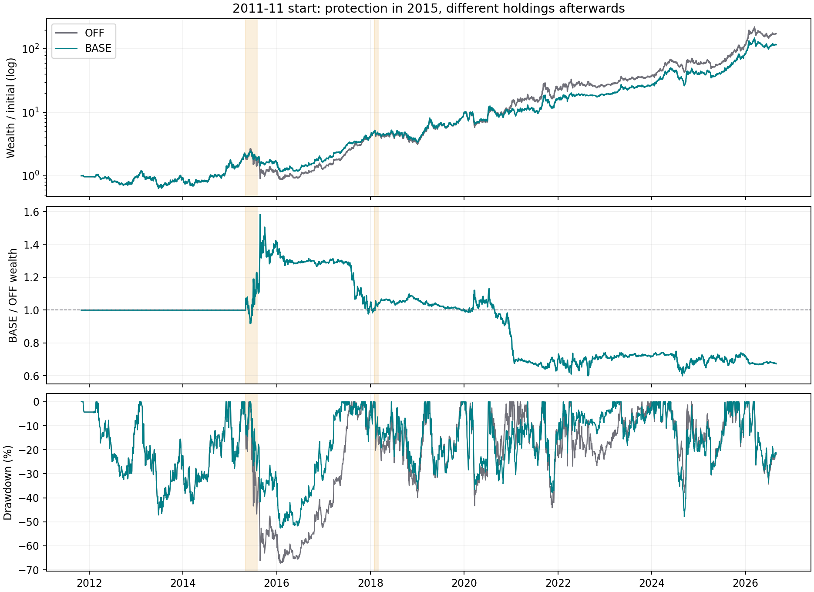
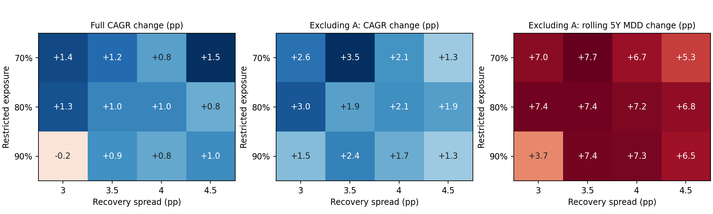

# 融资约束优化与长跑收益差异（2026-09-10）

## 为什么回撤降低，2011年起的年化反而下降

用户的推理在一个条件下成立：熊市少亏以后，如果两版策略后续取得完全相同的百分比收益，先前积累的财富优势会一直保留。这次回测不满足这个条件。约束主动卖出股票，改变现金、负债、持仓股数与后续买卖，恢复融资许可也不会自动买回原组合。

下文 **OFF** 是修复记账后的无股债约束策略，**BASE** 是目前E2生产规则：沪深300整体盈利收益率减中国10年国债收益率，利差低于3个百分点时股票市值不超过净资产100%；达到3个百分点恢复原融资许可。这两版均采用同一次记账修复，不混用旧记账读数。

2011-11-01至2026-08-28，300万元初始资金，OFF期末5.215亿元、CAGR41.62%，当前BASE期末3.508亿元、CAGR37.88%，年化低3.74个百分点；全程最大回撤由67.24%变为52.64%。最大回撤只描述峰谷损失，CAGR取决于最后累积了多少净资产，两个指标并不等价。

| 年份 | OFF当年收益 | 当前BASE当年收益 | 年末BASE/OFF资产 |
| --- | ---: | ---: | ---: |
| 2015 | −23.50% | +7.31% | 1.403 |
| 2016 | +10.29% | +1.72% | 1.294 |
| 2017 | +208.48% | +143.57% | 1.022 |
| 2018 | −17.59% | −14.09% | 1.065 |
| 2019 | +201.41% | +182.09% | 0.997 |
| 2020 | +22.58% | +3.98% | 0.846 |
| 2021 | +86.80% | +54.25% | 0.698 |

2015年确实防住了一部分下跌，年末财富领先40.3%。收益优势随后被消耗，到2019年末基本归零，2020—2021年进一步落后。逐年相对收益的对数和严格等于最终相对财富的对数，见[年度分解](../../data/experiments/exp_equity_bond_opt_20260910/diagnostic_annual.csv)。2011与2026为不完整年度，其余年度按上年末至当年末计算。

### 杠杆恢复与持仓路径的实证

2011年起的当前BASE仅在2015-05-04至2015-07-31、2018-02-01至2018-02-28受限。2015-08-03已解除约束，但实际到2015-10-28才重新出现融资负债；2018-03-01解除当天就重新融资。信号已知日与成交日分别留在[事件表](../../data/experiments/exp_equity_bond_opt_20260910/diagnostic_events.csv)。

2017年平均股票仓位为OFF167.92%、BASE168.93%，2020年为165.17%、167.45%；这些年份的落后不能解释为一直没有加回杠杆。持仓组合和仓位分配已经不同：

| 交易周期 | OFF累计买入金额 | 当前BASE累计买入金额 | OFF/BASE周期贡献 |
| --- | ---: | ---: | ---: |
| 牧原股份，2017-07起、2018-01结束 | 361.8万元 | 75.0万元 | 43.11% / 7.67% |
| 万华化学，2017-08起、2020-11/12结束 | 1,053.9万元 | 461.8万元 | 36.48% / 14.95% |
| 天齐锂业，2020-11起、2021-01/02结束 | 1,418.1万元 | 512.0万元 | 48.22% / 16.64% |

贡献是逐日单票盈亏/前一日净资产的累计值，**不是CAGR，也不能把贡献差直接相加当作年化损失**；累计买入金额也不等于某一天的仓位。这里用两者说明后续分配发生了实质变化，不能仅凭少亏了一次判断最终复利。[逐周期证据](../../data/experiments/exp_equity_bond_opt_20260910/diagnostic_cycles.csv)取原修复后同口径成交文件。

## 本轮冻结规则与比较口径

完整规则见[第一阶段预登记](../../data/experiments/exp_equity_bond_opt_20260910/preregister.md)。第一阶段45臂：当前BASE、OFF、固定100%仓位三个对照，42个新候选；见到80%方案的初步结果后，另预登记并检验70%/90% × 3/3.5/4/4.5pp的8个邻居。最终53臂，50个新候选；历史同族已试19臂。[第二阶段预登记](../../data/experiments/exp_equity_bond_opt_20260910/preregister_refine.md)属于看过第一阶段后的追加研究，不是样本外验证。多个共享终点的起点、重叠窗口及参数臂不能当作独立样本。

- 0%/30%/50%/80%/100%股票仓位上限，分别搭配3/3.5/4/4.5/5个百分点的恢复利差。
- 整体PE14/16/18/20倍；PE在此前60个月历史的70%/80%/90%分位。
- 沪深300月收盘价为60个月收盘均线的1.2/1.4/1.6倍时去融资。五年线按指数价格理解。
- 低利差时仍允许120%/140%/160%仓位；或增加6/10/12月价格趋势、连续2/3月利差确认才恢复融资。

仓位上限是股票市值/净资产，不是目标持仓；恢复仅解除约束。PE与五年线方案独立替换股债触发，其他方案修改当前股债规则。空余现金沿用原引擎，不计新增现金收益。

14个标准起点，全部全样本、剔除当前BASE五大赢家A，以及每一候选与BASE赢家并集U，同组对照。报告按全期CAGR配对差中位排序，另报m3同窗口滚五差、风险、2009/2011长跑锚点和完整标准指标。长跑单起点不替代14起点读数；初筛通过不等于已完成生产采纳验证。

增加部分融资与趋势确认的动机也与公开研究相符：估值对较长期收益的预测关系，并不自动转化成可实现的择时收益；估值与趋势结合值得检验。这只是设计参考，具体中国股票参数和结果均来自本仓库实验。[Asness、Ilmanen与Maloney（2017）](https://www.aqr.com/-/media/AQR/Documents/Insights/White-Papers/Market-Timing-Sin-a-Little.pdf)

## 数据与验证范围

股票价格缓存：296只面板证券中155只截止2026-08-07，140只截止2026-08-28，1只截止2018-12-20；所有臂沿用完全相同输入和缺报价处理，未用未来报价补齐。组合净值终点为2026-08-28。指数原始价格截止2026-08-07，五年线与趋势只用完整月份，最后为2026-07。60个月均线从2009-12开始有效，此前回退当前BASE并记录覆盖。

宏观PE与债息来自现有参考输入，保留原45日/10日陈旧校验，信号在T日已知、T+1成交，状态从全部历史重建，不随账户起点重置。当前下载历史不等于每个历史时点的原始版本，尚不能声称完整排除了历史数据修订偏差。

现存OI-167单票整手兜底行为沿用同一BASE。OI-172/173仍未修改生产：本轮独立严格核对完整起点、窗口、逐日日期与有限决策值；初筛的负窗否决按成文“由0转正”计算，避免已知报告缺口污染本轮比较。

## 结果

以下变化均相对**当前BASE**，单位为百分点；全/A分别为全样本与剔除当前BASE五大赢家。年化和最大回撤变化均先逐起点相减，再取14起点中位。最大回撤负值表示变浅。“通过”仅指§12.1第2款数值初筛，不代表已完成全部采纳验证。

### 最值得区分的几种选择

| 低利差时仓位 / 恢复门槛 | 年化Δ 全/A | 最大回撤Δ 全/A | 同窗口滚五Δ 全/A | 初筛 | U全面优秀 |
| --- | ---: | ---: | ---: | --- | --- |
| 100% / 3.5pp | +1.85 / 0.00 | 0.00 / 0.00 | +0.89 / 0.00 | 通过 | 是 |
| 100% / 4pp | +1.70 / 0.00 | 0.00 / 0.00 | +1.09 / 0.00 | 通过 | 是 |
| 80% / 3pp | +1.33 / +2.98 | −2.91 / −0.21 | +1.09 / +3.65 | 通过 | 否 |
| 80% / 3.5pp | +1.01 / +1.90 | −2.82 / 0.00 | +0.09 / +2.37 | 通过 | 否 |
| 50% / 3pp | +0.03 / +0.21 | −6.57 / −6.62 | −0.94 / +0.17 | 回撤通道 | 否 |
| 30% / 3pp | +0.17 / +2.77 | −8.55 / −7.01 | −1.38 / +3.30 | 未通过 | 否 |
| 30% / 3.5pp | +0.04 / +3.97 | −8.64 / −6.99 | −0.85 / +4.44 | 回撤通道 | 是 |
| 0% / 3pp | +0.83 / −1.91 | −3.66 / −8.65 | −0.70 / −4.91 | 未通过，含回撤闸门 | 否 |

**温和改动优先保留100%仓位、3.5～4pp恢复这组。** 3.5pp的全样本年化差中位+1.85pp，4pp为+1.70pp；A中位均为0，不能声称普遍增强了去赢家后的收益；各单起点仍有正有负。相比当前规则，最大回撤中位没有进一步改善。这组主要检验的是恢复时机，而不是更大幅度削减峰值风险。

**若进一步降低最大回撤是首要目标，保留30%仓位、3.5pp恢复作为单独的风险候选。** 全样本年化差+0.04pp在噪声带内，A为+3.97pp，最大回撤分别浅8.64/6.99pp，并通过回撤通道与U全面优秀检查。它不是已找到稳定的收益最优值：恢复到4pp后全样本年化差变成−1.33pp；0.03和0.035之间的主读数也跨过现行初筛线。30%仓位方向的相邻剂量、执行成本和赢家剂量仍需验证。

“3.5pp恢复”的具体规则是：利差<3pp触发限制；受限后即便利差回到3～3.5pp，也继续受限；达到3.5pp才解除。未受限时，利差从高位降到3.2pp不会单独触发。解除只恢复原融资与买入许可，不要求当天买满。这里的3/3.5pp是 **1/PE减10年国债收益率** 的差，不是指数涨跌幅。

2011路径的限制日数为BASE79日、3.5pp恢复101日、4pp恢复140日（共3602个有效信号日）。100%仓位的3.5pp与4pp方案在这条路径上却取得相同实际仓位和收益，说明信号限制多了，不一定产生额外交易。[实际约束覆盖](../../data/experiments/exp_equity_bond_opt_20260910/policy_actual_anchors.csv)

### 80%附近有收益区间，但风险取舍也同时存在

70%/80%/90%仓位 × 3.5/4/4.5pp的9格，全/A年化差均为正，说明80%的收益表现并非孤立尖峰。可是这9格的A滚五回撤差都为正，约加深5.33～7.71pp；新增8臂均未达到U全面优秀。较浅的全程最大回撤与较深的典型滚五回撤可以同时出现，不能用前者遮盖后者。

80%/3pp在2011长跑的CAGR达到46.91%，看起来远好于当前37.88%，但其A/U滚五回撤加深7.43pp。80%/3.5pp的2011年化45.72%，2009锚点却从37.84%降到34.17%。只盯2011一条路径会把这种取舍漏掉。

### PE、五年线和其他恢复方式

| 方案 | 全/A年化Δ | 观察 |
| --- | ---: | --- |
| PE≥16倍去融资 | +0.82 / −1.71 | 全样本正、去赢家负，未通过 |
| 价格≥60月均线1.6倍去融资 | +0.73 / −2.02 | 同样没有通过去赢家检验 |
| PE14倍 | −5.81 / −3.47 | 比现行规则差 |
| PE18/20倍 | −1.87 / −2.88 | 本轮交易结果与OFF一致，不能替代当前保护 |
| PE历史70%～90%分位 | −15.19～−7.37 / −15.31～−4.99 | 三档均负；分位不是较优替代 |
| 价格为60月线1.2/1.4倍 | −9.60/−1.03；A−5.32/−2.53 | 两档均负 |
| 低利差仍保留120%/140%/160%仓位 | 全−0.74/−1.64/−1.91；A−1.05/−1.83/−0.01 | 全程最大回撤重新加深，三个剂量均未通过 |
| 连续2/3月利差≥3pp才恢复 | +0.21 / 0.00 | 初筛和U通过，但改善小于3.5～4pp滞回 |
| 增加6月趋势确认 | −0.59 / −0.77 | 仍未通过 |
| 增加10/12月趋势确认 | 0.00 / 0.00 | 只有最早两个起点响应，整体中位无改善 |

相同信号历史有PE18/20、趋势10/12两组，见[重复信号清单](../../data/experiments/exp_equity_bond_opt_20260910/identical_policy_groups.json)。不能把相同交易或信号当作相互独立的证据。价格均线与PE只是本次有限网格中的结果，不能据此推断所有相关择时设计都无效。

### 两个长跑锚点

| 方案 | 2009年起CAGR / 最大回撤 | 2011年起CAGR / 最大回撤 |
| --- | ---: | ---: |
| 当前BASE | 37.84% / 56.37% | 37.88% / 52.64% |
| 100% / 3.5pp | 40.36% / 56.10% | 38.12% / 52.64% |
| 30% / 3.5pp | 37.34% / 46.29% | 38.47% / 47.50% |
| 80% / 3pp | 39.52% / 54.87% | 46.91% / 48.32% |
| 50% / 3pp | 39.48% / 49.63% | 42.95% / 48.68% |

完整全/A/U锚点、水平值与配对差见[锚点表](../../data/experiments/exp_equity_bond_opt_20260910/anchors.csv)。原问题中的年化下降针对2011长跑：当前BASE对OFF在14起点的全期CAGR差中位仍为+1.87pp，A为+2.88pp；一个锚点下降不等于整个起点集收益变差，也不能拿起点集中位掩盖该锚点的真实损失。

### 验证、产物与下一步资格

第一阶段作业26517945完成1526条回测，第二阶段26518513完成350条，合计1876条正式扫描路径，另有3条先行试跑。每阶段的BASE全/A各28条均复现原值。合并后2296条摘要（含U=A复用）及1848条唯一净值路径完成完整日期和窗口核验，负现金日数为0。7项策略测试、3项比较完整性/否决检查、9项原股债执行测试和4项生产参数同步检查通过。作业耗时12分48秒与2分56秒，峰值内存均约65GiB，配置64CPU。

1484条全/A研究摘要已通过`clean_derived_artifacts.write_ledger`归入现行m3台账，按臂索引新增`EBOPT`前缀53臂（50候选、3对照）；U留在本实验配对证据内，不把不同赢家集合重复数作新候选。[登记记录](../../data/experiments/exp_equity_bond_opt_20260910/registration.json)

50个新候选中，17个普通初筛通过、2个回撤通道、2个数值要求用户裁定、29个不通过；U全面优秀另有8个名义候选，登记OI-174。该资格本身不构成生产采纳：其中30%/4.5pp仍未通过全/A收益初筛，趋势10/12多数路径未响应。

本轮完成了用户要求的替代设计与全/A/U研究。**生产仍为原3pp/100%规则。** 100%/3.5～4pp与30%/3.5pp分别作为温和恢复、进一步降回撤两个研究方向；正式替换前还需换仓边际、K1/3/5/10赢家剂量、0/10/20/30bp滑点、信号层及归因检查与用户裁定。尤其不能将已在基础费税下通过的结果写成已通过滑点压力检验。

- [53臂判定与关键读数](../../data/experiments/exp_equity_bond_opt_20260910/decisions.csv)
- [全/A完整标准报告](../../data/experiments/exp_equity_bond_opt_20260910/report_full_A.txt)；[全/A/U全部逐项配对](../../data/experiments/exp_equity_bond_opt_20260910/paired_metrics.csv)
- [首轮仓位×恢复阈值图](../../data/experiments/exp_equity_bond_opt_20260910/hysteresis_grid.png)
- [第一阶段验证](../../data/experiments/exp_equity_bond_opt_20260910/verification.json)、[第二阶段验证](../../data/experiments/exp_equity_bond_opt_20260910/refine_verification.json)、[合并完整性验证](../../data/experiments/exp_equity_bond_opt_20260910/analysis_verification.json)

复现：按仓库计算规范提交 `scripts/slurm/equity_bond_opt_20260910.sbatch`，完成后提交 `scripts/slurm/equity_bond_opt_refine_20260910.sbatch`；最后运行 `MPLCONFIGDIR=/tmp/raykey_ebopt_mpl python3 data/experiments/exp_equity_bond_opt_20260910/analyze.py`。原始输入由manifest哈希约束；大型中间净值/诊断/缓存不入库，周期归因小表保留为前轮原始成交的摘录证据。
