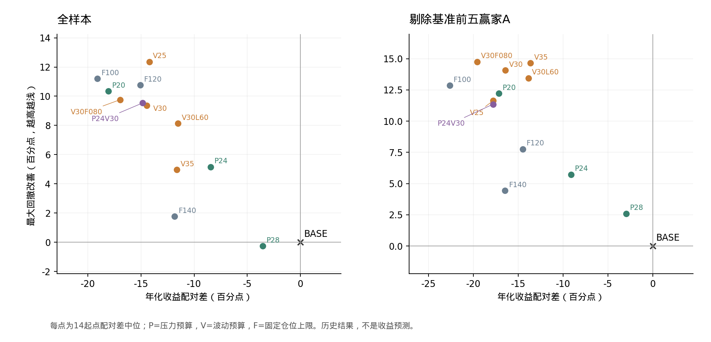

# 压力预算与波动率去融资：回测结果（2026-09-11）

## 决策读数

**两类机制确实能削减部分大回撤，但本轮全部12个候选均未通过当前收益保留要求。压力预算P24比近似仓位的固定上限对照更好，仍明显损失相对当前BASE的年化收益；波动率目标的代价更大。暂不建议据此更改生产规则。**

已完成14个标准起点（2009-11至2016-05，半年档），全样本／剔除基准赢家A／赢家并集U，以及预登记中心的每边30bp滑点压力：574条实际执行路径、644条报告摘要，其中70条U记录复用同剔除集的A路径。另有4条有效工程小样本，不计正式扫描。数据末端仍为2026-08-28，没有新增样本外检验。

下表全部为**逐起点配对差的跨起点中位数，单位百分点**。年化是全期CAGR；主读数是m3同起点同月末滚五窗口配对差；最大回撤Δ为负表示更浅。禁止以两个独立水平中位数相减替代这里的差值。按全样本Δ年化排序，A表始终与全样本并列。

| 候选 | 机制 | Δ年化 全/A | Δ主读数 全/A | Δ最大回撤 全/A |
| --- | --- | --- | --- | --- |
| P28 | 前三压力预算28% | -3.55 / -2.94 | -3.60 / -6.36 | +0.25 / -2.59 |
| P24 | 前三压力预算24% | -8.44 / -9.10 | -6.03 / -13.65 | -5.16 / -5.72 |
| V30L60 | 目标30%，仅60日 | -11.51 / -13.85 | -10.73 / -17.05 | -8.13 / -13.44 |
| V35 | 目标波动35% | -11.63 / -13.62 | -10.77 / -14.25 | -4.96 / -14.65 |
| F140 | 固定上限140% | -11.83 / -16.47 | -10.99 / -19.48 | -1.78 / -4.44 |
| V25 | 目标波动25% | -14.21 / -17.79 | -10.83 / -20.42 | -12.35 / -11.63 |
| V30 | 目标波动30% | -14.44 / -16.42 | -13.28 / -17.61 | -9.37 / -14.06 |
| P24V30 | 两个中心联合 | -14.86 / -17.81 | -13.43 / -19.06 | -9.53 / -11.35 |
| F120 | 固定上限120% | -15.06 / -14.48 | -11.77 / -14.51 | -10.76 / -7.77 |
| V30F080 | 目标30%，仓位下限80% | -16.97 / -19.55 | -16.89 / -21.05 | -9.76 / -14.75 |
| P20 | 前三压力预算20% | -18.09 / -17.15 | -19.19 / -19.41 | -10.34 / -12.21 |
| F100 | 固定上限100% | -19.09 / -22.63 | -18.42 / -24.55 | -11.20 / -12.85 |

## 采纳判定

12/12不采纳，0/12达到“去赢家全面优秀”。P24虽然两表最大回撤均改善超过5pp，但主读数损失6.03/13.65pp、年化损失8.44/9.10pp，未通过回撤通道的收益保留条件。宽松的P28年化损失仍为3.55/2.94pp，全样本最大回撤还加深0.25pp。联合中心也没有挽回取舍。

U1在A基础上另剔除海螺水泥600585；P20、V25、V30、V35、V30F080、F120、F140、P24V30在此比较。P24、P28、V30L60、F100的U2恰等于A，复用同批A路径。各U内候选与BASE统一剔除，未把不同U的候选直接相互排序。A固定为000338、000651、000933、002128、601088，来自BASE2011锚点的累计相对净资产贡献前五名。

判定按工作流§12.1成文规则执行。OI-172用完整起点、相同月末窗口集合及有限值检查隔离；OI-173在实验中按负窗“由0转正”计数，同时保留旧实现结果，本轮无最终判定翻转。生产判定器未改。因没有候选通过初筛，按预登记不追加10/20bp全套采纳前成本，也未宣称完成换仓边际重扫、K剂量或信号层三表。

## 跨起点尾部

以下是14条模拟路径中的最值，**不是配对差，也不是14个独立市场事件**。数值以全/A并列；担保比例按百分数显示。全部正式路径强平次数和负现金日数均为0，BASE同样没有模拟强平，因此不能把缓冲改善写成已避免了实际强平。

| 臂 | 最深全期MDD % 全/A | 最差滚五CAGR % 全/A | 最低担保 % 全/A | 最低股票同跌缓冲 % 全/A |
| --- | --- | --- | --- | --- |
| BASE | 51.04 / 50.25 | 2.05 / 3.41 | 182.25 / 186.36 | 28.67 / 30.24 |
| P28 | 49.09 / 49.48 | -0.29 / 6.56 | 185.20 / 213.55 | 29.80 / 39.12 |
| P24 | 46.72 / 45.87 | 2.04 / 3.89 | 209.62 / 217.36 | 37.98 / 40.19 |
| V30L60 | 41.51 / 40.29 | 1.85 / 3.17 | 218.46 / 222.89 | 40.49 / 41.68 |
| V35 | 44.30 / 41.12 | 0.68 / 1.40 | 222.51 / 220.19 | 41.58 / 40.96 |
| F140 | 45.75 / 47.85 | -0.35 / 1.85 | 314.99 / 317.62 | 58.73 / 59.07 |
| V25 | 38.65 / 41.36 | 5.00 / 1.06 | 233.30 / 232.93 | 44.28 / 44.19 |
| V30 | 40.50 / 41.15 | 1.84 / 0.35 | 228.12 / 231.04 | 43.01 / 43.73 |
| P24V30 | 38.74 / 41.14 | 0.83 / 2.13 | 228.31 / 228.63 | 43.06 / 43.14 |
| F120 | 42.60 / 43.97 | 1.65 / 0.73 | 540.03 / 543.69 | 75.93 / 76.09 |
| V30F080 | 39.68 / 39.38 | 1.71 / -0.10 | 223.49 / 229.47 | 41.83 / 43.35 |
| P20 | 40.29 / 40.54 | 4.82 / -0.74 | 228.02 / 218.77 | 42.99 / 40.58 |
| F100 | 39.14 / 40.91 | 4.44 / -1.01 | 3051.64 / 25411.39 | 95.74 / 99.49 |

每个尾部最值的起点和发生日期、负窗起点数、无风险利率覆盖及末端见[tails.csv](../../data/experiments/exp_risk_budget_20260911/tails.csv)。其余标准指标和两锚点为下列附表与[完整正式报表](../../data/experiments/exp_risk_budget_20260911/formal_report.txt)，不另改决策读数。

## 附表：规则、设计与可复现性

唯一规则定义是[预登记](../../data/experiments/exp_risk_budget_20260911/preregister.md)与[grid.json](../../data/experiments/exp_risk_budget_20260911/grid.json)，均在候选收益出现前固定。概要如下：

- P：以前三持仓同时下跌20%、其余不动为固定情景，用信号日股票内部前三占比计算次日总仓位上限。测试预算20/24/28%。这不是统计ES，也不是成交后绝不超预算的保证。
- V：以自身当前股票内部权重作用于过去20/60交易日复权总回报，取两种年化波动估计的较大值。目标25/30/35%；主要先去融资、最低保留100%股票仓位。另检验60日单窗口及80%下限。
- 新上限与原C030R35宏观上限取较低者。P/V按10个百分点分档，收紧立即生效，恢复每天最多10个百分点；解除只恢复原买入许可。固定100/120/140%上限作对照，联合中心取P24/V30较低者。
- 信号只取T收盘前后已知的信息与T收盘实际持仓，T+1收盘执行。每臂用自身持仓反馈。原选股、按比例减仓、整手、税费、融资利息、净额对冲及停牌处理均保留。

原始数据冻结与上轮诊断相同；从Git恢复已更新的分红、利率和股债数据到实验raw/frozen，逐一验哈希。296份股票行情中155份止于08-07、140份止于08-28、1份止于2018年，不把“净值到08-28”写成所有个股报价都到08-28。没有刷新数据或修改BASE。

工程检查：10个针对性测试通过；OFF与原BASE在2011长跑逐日一致；正式28条BASE复现92,422行原净值。执行审计扫描1,894,651行净值、1,663,092条风险信号，均满足持仓观察日≤信号日<执行日。负现金按原引擎−1e−6元容差计为0，最小现金-1.86e-09元是浮点残差。

SLURM正式作业26572140完成，用时16分17秒，16CPU／12工作进程，MaxRSS约16.36GiB（分配28GiB）。首个工程小样本26572054因内存编译遗漏延后注解而失败，候选交易尚未开始；修复记录在repair_log.json，26572119通过后才提交正式扫描。正式扫描无失败路径、无丢弃起点。574份正式摘要经write_ledger登记，原台账逐值保留；按台账臂名计本批41个名称，包含全/A/U及成本对照，经济定义仍为12候选＋1基准，OFF不计入。

## 附表：收益与回撤取舍

下表为跨起点水平中位，仅描述配置实际运行状态；差值以首页配对差为准。仓位及权重分母为净资产，融资时可超过100%。

| 臂 | 年化 % 全/A | 最大回撤 % 全/A | 平均仓位 % 全/A | 前三权重 % 全/A |
| --- | --- | --- | --- | --- |
| BASE | 45.02 / 53.45 | 46.03 / 49.56 | 157.41 / 152.14 | 142.64 / 134.39 |
| P24 | 37.47 / 44.32 | 41.77 / 43.67 | 128.91 / 129.88 | 115.38 / 114.39 |
| V30 | 29.84 / 36.79 | 36.84 / 35.54 | 110.09 / 119.48 | 96.90 / 99.22 |
| P28 | 41.90 / 50.66 | 47.49 / 47.30 | 149.75 / 145.94 | 132.24 / 129.26 |
| V25 | 30.84 / 34.39 | 34.71 / 37.90 | 104.16 / 107.14 | 96.99 / 94.80 |
| F120 | 29.68 / 37.48 | 36.31 / 41.43 | 112.00 / 109.48 | 112.16 / 105.76 |
| F140 | 32.99 / 37.41 | 44.89 / 45.10 | 130.64 / 126.53 | 124.11 / 116.24 |
| P24V30 | 29.05 / 35.44 | 36.49 / 38.30 | 104.43 / 110.99 | 96.29 / 99.25 |

P24、V30在全样本14起点的“新风险上限比原宏观上限更严格”日数比例中位为81.64%、80.94%；A表为71.46%、68.42%。这统计的是约束状态，不等同每天卖出。它们大部分时间处于降仓状态，因而没有实现只避开少数灾难阶段的目标。P24全/A平均仓位降至约129%/130%；V30降至110%/119%。

**压力信息相对固定降仓有增量，但不能用它替代与BASE的比较。** 直接逐起点比较如下；仍为百分点，MDD负数更浅。

| 候选－对照 | Δ年化 全/A | ΔMDD 全/A | Δ平均仓位 全/A |
| --- | --- | --- | --- |
| P24－F140 | +4.04 / +7.38 | -3.19 / -2.39 | -0.88 / +2.26 |
| V30－F120 | -0.60 / -1.86 | +1.75 / -3.16 | -1.62 / +8.63 |
| V25－F100 | +4.36 / +3.28 | -1.65 / +0.20 | +10.17 / +14.16 |

P24与F140的平均仓位相近，两表收益和回撤均占优，支持继续研究集中度条件的信息价值。V30相对F120在全样本收益更低、回撤反而更深，在A表则以收益换回撤；V25相对F100的年化优势伴随更高实际仓位，不能全部归为择时能力。固定对照是预登记的三档，以上“仓位相近”是结果描述，没有按事后仓位精确匹配或调整参数。

## 附表：原有大回撤段是否改善

以2011-11-01长跑为例，下表用BASE原来的峰日和谷日计算各候选自己的净值损失。每行日期完全相同；这既不是各候选自身最大回撤，也不代表预测到了峰谷。

| BASE峰日→谷日 | BASE损失 % | P24损失 % | V30损失 % |
| --- | --- | --- | --- |
| 2024-05-29→2024-09-11 | 47.50 | 42.15 | 36.12 |
| 2013-02-08→2013-06-25 | 47.16 | 34.62 | 30.14 |
| 2015-04-27→2016-06-13 | 45.54 | 34.47 | 27.08 |
| 2021-09-22→2021-11-16 | 37.46 | 33.35 | 28.96 |
| 2020-01-03→2020-03-23 | 34.16 | 34.49 | 29.35 |
| 2020-07-20→2021-02-05 | 34.15 | 14.85 | 19.69 |
| 2018-06-12→2019-01-03 | 33.86 | 25.66 | 20.71 |

P24改善了2013、2015—2016和2024段，但2020疫情段几乎没有改善。P28更宽松，也可能改变后续持仓并加深某段损失：2021固定段由BASE37.46%变为42.11%。因此不能把减仓幅度与全期MDD改善视为单调关系。

**回撤变浅没有保证恢复更快。** 2024段三者自身峰谷相同；BASE在2024-11-07恢复，P24在2025-07-24恢复，V30在2025-10-09恢复。从峰日计算分别162、421、498个自然日。下表还保留各自最深三段的真实恢复日期，不用固定峰谷损失代替独立回撤。

| 臂 | 自身峰日→谷日 | 回撤 % | 恢复日 | 峰至恢复自然日 |
| --- | --- | --- | --- | --- |
| BASE | 2024-05-29→2024-09-11 | 47.50 | 2024-11-07 | 162 |
| BASE | 2013-02-08→2013-06-25 | 47.16 | 2014-12-02 | 662 |
| BASE | 2015-04-27→2016-06-13 | 45.54 | 2017-05-25 | 759 |
| P24 | 2024-05-29→2024-09-11 | 42.15 | 2025-07-24 | 421 |
| P24 | 2015-06-09→2016-02-01 | 35.00 | 2016-11-28 | 538 |
| P24 | 2020-02-17→2020-03-23 | 34.93 | 2020-07-08 | 142 |
| V30 | 2024-05-29→2024-09-11 | 36.12 | 2025-10-09 | 498 |
| V30 | 2020-02-17→2020-03-23 | 33.94 | 2020-07-20 | 154 |
| V30 | 2013-02-08→2014-03-20 | 33.55 | 2014-12-02 | 662 |

2009长跑、A表以及各候选全部固定区间见same_interval_events.csv；每条路径各自最深三段见own_episodes.csv。前者的recovered_after_base_trough仅表示BASE谷日之后首次达到候选在BASE峰日的净值，不是候选全部回撤的统一恢复日期。

## 附表：两长跑与牛市代价

| 臂 | 口径 | 起点 | 全期年化 % | 最大回撤 % | Δ年化 pp | ΔMDD pp |
| --- | --- | --- | --- | --- | --- | --- |
| BASE | full | 2009-11-01 | 37.34 | 46.29 | +0.00 | +0.00 |
| BASE | full | 2011-11-01 | 38.47 | 47.50 | +0.00 | +0.00 |
| P24 | full | 2009-11-01 | 29.13 | 42.11 | -8.22 | -4.17 |
| P24 | full | 2011-11-01 | 36.01 | 42.15 | -2.46 | -5.35 |
| V30 | full | 2009-11-01 | 24.53 | 37.40 | -12.81 | -8.89 |
| V30 | full | 2011-11-01 | 26.97 | 36.12 | -11.50 | -11.38 |
| BASE | A | 2009-11-01 | 42.18 | 49.07 | +0.00 | +0.00 |
| BASE | A | 2011-11-01 | 49.10 | 49.10 | +0.00 | +0.00 |
| P24 | A | 2009-11-01 | 36.32 | 45.87 | -5.86 | -3.20 |
| P24 | A | 2011-11-01 | 39.92 | 43.79 | -9.18 | -5.31 |
| V30 | A | 2009-11-01 | 28.05 | 39.64 | -14.12 | -9.43 |
| V30 | A | 2011-11-01 | 32.99 | 33.95 | -16.11 | -15.16 |

只看2011锚点，P24年化损失2.46pp，容易低估代价；2009锚点损失8.22pp，全样本14起点配对中位损失8.44pp。多起点在这里改变了评价。

2011锚点全样本完整自然年收益如下。不同年份出现好坏方向切换，恢复许可本身不会自动补回持仓。

| 年份 | BASE % | P24 % | V30 % |
| --- | --- | --- | --- |
| 2012 | -1.13 | 0.07 | -0.77 |
| 2013 | -2.98 | -2.81 | -7.30 |
| 2014 | 66.16 | 54.26 | 53.13 |
| 2015 | 32.72 | 25.20 | 15.86 |
| 2016 | -17.74 | -3.55 | 6.54 |
| 2017 | 121.86 | 151.54 | 81.57 |
| 2018 | -7.88 | 3.52 | 2.06 |
| 2019 | 186.85 | 140.04 | 126.44 |
| 2020 | 5.08 | 3.42 | 2.05 |
| 2021 | 52.18 | 59.38 | 46.56 |
| 2022 | 22.64 | 0.46 | 0.15 |
| 2023 | 37.50 | 36.29 | 41.13 |
| 2024 | 56.01 | 41.76 | 35.42 |
| 2025 | 103.47 | 90.71 | 50.24 |

例如2025年收益为103.5%／90.7%／50.2%，2024年为56.0%／41.8%／35.4%。P24全/A年均换手水平为7.13/6.33次，BASE为6.40/5.94次；V30为5.93/7.25次。收益损失伴随持续低仓位和上涨阶段少参与，不能简单归结为手续费。

## 附表：交易成本压力

0bp仍包含原手续费、税费和融资利息。30bp为每边额外滑点，进入成交股数、整手、资金与费用计算，候选和BASE同档配对，A固定0bp赢家。中心为预先指定，未挑事后最佳参数。

| 候选 | 每边滑点 bp | Δ年化 全/A | Δ主读数 全/A | ΔMDD 全/A | 判定 |
| --- | --- | --- | --- | --- | --- |
| P24 | 0 | -8.44 / -9.10 | -6.03 / -13.65 | -5.16 / -5.72 | 不采纳 |
| V30 | 0 | -14.44 / -16.42 | -13.28 / -17.61 | -9.37 / -14.06 | 不采纳 |
| P24 | 30 | -9.14 / -7.43 | -10.07 / -11.28 | -6.34 / -3.43 | 不采纳 |
| V30 | 30 | -17.02 / -17.15 | -16.84 / -19.31 | -9.91 / -13.01 | 不采纳 |

各臂30bp相对自身0bp的变化如下；仍按逐起点配对，不以不同成本档的汇总中位数相减。

| 臂 | Δ年化 全/A | Δ滚五主读数 全/A | Δ滚五回撤 全/A | Δ最低担保比例 全/A |
| --- | --- | --- | --- | --- |
| BASE | -1.93 / -1.90 | -1.19 / -2.11 | -0.77 / +0.31 | +0.06 / +0.30 |
| P24 | -1.39 / -1.80 | -1.96 / -1.52 | +0.09 / +0.18 | +1.95 / -0.04 |
| V30 | -2.61 / -2.36 | -2.35 / -1.66 | +0.14 / +0.07 | +0.01 / +0.03 |

表中担保比例差也以百分点显示；全部档位的强平仍为0，成本档未翻转判定。未跑的10/20bp和U成本档不冒称已验证；若以后更改候选并重新进入采纳评估，需按工作流补齐。

## 附表：执行边界与后续研究判断

压力预算约束的是依据昨天集中度推导的今日总仓位，并非今日收盘的精确前三损失上限。P24全样本0bp的46,197个执行路径日中，1,393日实际前三情景损失超过24%（约3.0%），最大超出3.49pp；该组总仓位上限本身没有超限。换仓改变前三构成、下一交易日价格变化会造成差异。其定义和偏差记录均在预登记，不把它包装为硬性尾部保障。

整个正式批次有555个路径日暂时超过合并仓位上限，全部与原引擎unresolved记录逐日吻合，分布在15条路径的2018-02-01至03-30；最大超出12.29个百分点。涉及V35、V30、V30F080及联合中心的去赢家路径。当时原宏观上限降至30%，缺少当日报价的持仓无法按上限卖出，沿用原引擎延后处理；没有虚构停牌成交。它们是重复路径日，不是555次独立停牌事件。明细见constraint_exceptions.csv。

波动指标还存在覆盖限制。V30全/A缺少足够有效观测的执行日比例跨起点中位为8.03%/10.40%；这些日子按预登记回退100%仓位上限。因此本轮检验包含“波动率信号＋缺数据回退”的联合行为，未做拆除缺失回退的归因对照。通过覆盖检查的窗口对剩余缺日填0，停牌期间潜在风险仍可能被低估；不能把30%目标解释为已实现波动必定不超过30%。

本轮结果支持的下一步顺序：先保留压力指标作为研究诊断；若继续开发，优先单独检验“按风险贡献选择减谁”，再检验异常集中时才收紧的条件，避免持续对全部持仓按比例压低仓位。协方差风险贡献、行业链联合压力和统计ES尚未测试，不能因本轮结果直接声称有效。普通波动目标不宜因少数回撤段好看就进入生产；20/60日、单60日、80%下限及联合臂均未解决年化代价。

这轮共有12个预登记候选（包含3个固定对照），共享终点与重叠窗口并非独立样本；这些历史结果不能当作未来年化点预测，也不是所有压力或波动机制都会失败的证明。生产与BASE保持原规则，本轮只登记研究证据。

## 证据入口

- [实验README与复现命令](../../data/experiments/exp_risk_budget_20260911/README.md)、[预登记](../../data/experiments/exp_risk_budget_20260911/preregister.md)、[输入冻结](../../data/experiments/exp_risk_budget_20260911/manifest.json)。
- [全部判定](../../data/experiments/exp_risk_budget_20260911/decisions.csv)、[标准指标与配对差](../../data/experiments/exp_risk_budget_20260911/standard_metrics.csv)、[长跑锚点](../../data/experiments/exp_risk_budget_20260911/anchors.csv)、[固定仓位对照](../../data/experiments/exp_risk_budget_20260911/fixed_control_comparisons.csv)。
- [固定回撤区间](../../data/experiments/exp_risk_budget_20260911/same_interval_events.csv)、[自身回撤与恢复](../../data/experiments/exp_risk_budget_20260911/own_episodes.csv)、[执行审计](../../data/experiments/exp_risk_budget_20260911/execution_checks.json)、[超限明细](../../data/experiments/exp_risk_budget_20260911/constraint_exceptions.csv)。
- [正式路径验证](../../data/experiments/exp_risk_budget_20260911/verification.json)、[台账登记](../../data/experiments/exp_risk_budget_20260911/registration.json)、[前置大回撤诊断](drawdown_review_2026-09-11.zh.md)。原始逐日大件在实验raw/，不重复入库。
